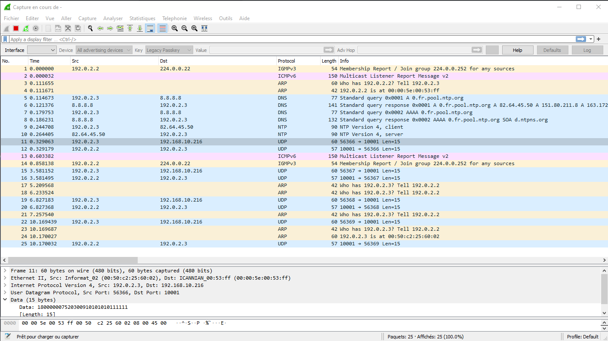
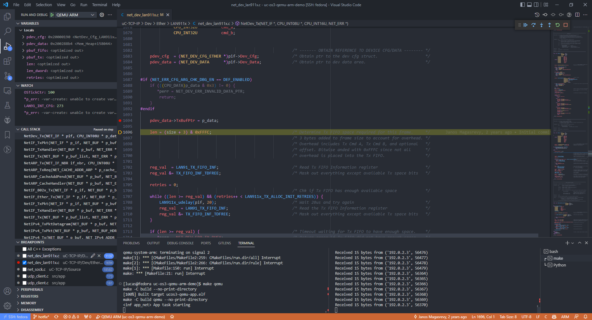

# Micrium OS III demo application for QEMU (Networking)

Attempt to test networking feature of a Micrium OS III application in QEMU for ARM.

Currently, the following boards and features are planned (P), being implemented (I) and tested (T):

| Status | Board (QEMU / cpu)        | Arch            | Manufacturer | Ethernet driver | Current state                 |
| ------ | ------------------------- | --------------- | ------------ | --------------- | ----------------------------- |
| I      | mps2_an385                | ARMv7 Cortex M3 |              | smsc911x        | Ethernet, UART, timer drivers |
| P      | netduinoplus2 - stm32f405 | ARMv7 Cortex M4 |              | -               | UART driver                   |
| P      | Stellaris - lm3s6965evb   | ARMv7 Cortex M3 | TI           | stellaris       | UART driver                   |

**Note**:
- For the moment partial Networking features are only supported on `mps2_an385` board. 

The goal of this project is to build an Micrium OS III in order to run application using QEMU emulated board.
Rationale for this is to be able to develop and test Micrium OS III applications with networking features without any hardware.

**Roadmap**:
- **OK :** Create the CMakeLists.txt for different boards.
- **OK :** Link Micrium OS III and run it on QEMU
- **OK :** Link TCP/IP stack, integrate driver `smsc lan911x` for `mps2_an385`, debug
- **OK :** Check UDP capabilities (client)
- **NOK:** Check TCP capabilities (client/server), including robustness
- **NOK:** Implement TLS (client) communication using mbedTLS
- **OK :** Add a RAM FS
- **NOK:** Implement and test a complete application (using networking/FS)
- **NOK:** Add support for other boards/drivers (e.g. mps2_an385, netduinoplus2, stellaris)

Also read board specific readme.md files:
- [mps2_an385/readme.md](./src/boards/mps2_an385/readme.md)
- [netduinoplus2/readme.md](./src/boards/netduinoplus2/readme.md)
- [lm3s6965evb/readme.md](./src/boards/lm3s6965evb/readme.md)

## Getting started

**Prerequisites**:
- Linux machine recommended (tested with Fedora)
- QEMU v7.0.0 with patches
- Many others tools, please check the section *Tools and Versions* below

**Get**:
1. Clone the repository from [github.com/lucasdietrich/micrium-os3-qemu-arm-demo](https://github.com/lucasdietrich/micrium-os3-qemu-arm-demo), with submodules: `git clone https://github.com/lucasdietrich/micrium-os3-qemu-arm-demo.git --recurse-submodules`. Repo size with submodules is about 2GB.
2. Open the project with Visual Studio Code (or your favorite IDE).

**Build**:
- In order to build for `mps2_an385` target: 
  `cmake -DCMAKE_TOOLCHAIN_FILE=./toolchain-arm-none-eabi.cmake -DCMAKE_BUILD_TYPE=Debug -DDO_DISASSEMBLY=1 -DBOARD=mps2_an385 -DCONFIG_NETWORKING=1 -DCONFIG_FS=1 -S . -B build`
  - The `DO_DISASSEMBLY` option is used to enable disassembly of the binary. Disable it if you don't need it.
- Make `make -C build`
- If build succeeds, you should get something like this:
```
Memory region         Used Size  Region Size  %age Used
           FLASH:      152588 B         4 MB      3.64%
             RAM:      288176 B         4 MB      6.87%
```

**Prepare for Networking :**
If your firmware contains Networking features you need to perform few more steps before you can run the application:
In a terminal, run following commands:
- Enable forwarding: `sudo sysctl -w net.ipv4.ip_forward=1`
- `sudo iptables -t nat -A POSTROUTING -j MASQUERADE -s 192.0.2.3`
- `sudo ./scripts/net-setup.sh`
- Keep the terminal open throughout the runs.
- You should see that the network interface `meth` is up and running.
```
meth: flags=4163<UP,BROADCAST,RUNNING,MULTICAST>  mtu 1500
        inet 192.0.2.2  netmask 255.255.255.0  broadcast 0.0.0.0
        inet6 fe80::200:5eff:fe00:53ff  prefixlen 64  scopeid 0x20<link>
        inet6 2001:db8::2  prefixlen 128  scopeid 0x0<global>
        ether 00:00:5e:00:53:ff  txqueuelen 1000  (Ethernet)
        RX packets 1621  bytes 131726 (128.6 KiB)
        RX errors 0  dropped 0  overruns 0  frame 0
        TX packets 1781  bytes 136377 (133.1 KiB)
        TX errors 0  dropped 0 overruns 0  carrier 0  collisions 0
```
- Networking informations:
  - Mask is `255.255.255.0`
  - Your application has address `192.0.2.3`
  - Gateway address is `192.0.2.2`

**Run**:
- Once you have set up the network, you can run the application with command `make run`.
  You should see following output in the console (this is basically the code
  executed in [src/app/app.c](./src/app/app.c)), which does:
  1. Net interface init
  2. UART init
  3. OS Clock init
  4. RAM FS init
  5. DNS init
  6. SNTP init and sync
  7. Misc timer configuration
  8. Loops querying an UDP server and printing time

```
<inf app_net> Clk_OS_Init err=100

===================================================================
=                        FS INITIALIZATION                        =
===================================================================
Initializing FS...
    ===========================================================    
    Adding/opening RAM disk volume "ram:0:"...
    ...opened device.
    ...opened device (not formatted).
...init succeeded.
===================================================================
===================================================================

<inf app_net> App_FS_Init -> 1
<dbg app_net.fs_file_create_n_write> FSFile_Open file=0x200aa800 err=0
<dbg app_net.fs_file_create_n_write> FSFile_Wr written=12 err=0
<dbg app_net.fs_file_create_n_write> FSFile_Close err=0
<dbg app_net.fs_file_read> FSFile_Open file=0x200aa800 err=0
<dbg app_net.fs_file_read> FSFile_Rd read=12 err=0
<dbg app_net.fs_file_read> FSFile_Close err=0
<dbg app_net.fs_file_read> FS file ram:0:\test.txt read matches read = 1
<inf app_net> DNSc_Init err=1
<inf app_net> SNTPc_Init -> 1, err=0)
<inf app_net> App_SNTPc_SetClk 0.fr.pool.ntp.org:123 -> 1
<inf app_net> App task starting
<inf app_net> Clk_GetTS -> 714428183 s
<inf udp_client> NetSock_TxDataTo succeeded
<inf udp_client> NetSock_RxDataFrom succeeded
<inf app_net> Clk_GetTS -> 714428188 s
<inf udp_client> NetSock_TxDataTo succeeded
<inf udp_client> NetSock_RxDataFrom succeeded
<inf app_net> Clk_GetTS -> 714428193 s
<inf udp_client> NetSock_TxDataTo succeeded
<inf udp_client> NetSock_RxDataFrom succeeded
<inf app_net> Clk_GetTS -> 714428198 s
<inf udp_client> NetSock_TxDataTo succeeded
<inf udp_client> NetSock_RxDataFrom succeeded
```

Wireshark output:


**Test**:
- You should be able to ping your application with command `ping 192.0.2.3 -c 1`

**Test UDP client**:
- If you're running the UDP client demo, you can run the python UDP server in a separate terminal with command `python3 ./scripts/udp-server.py`.
- Expected python output:
```
Waiting for incoming UDP packet on port 10001 ...
Received 15 bytes from ('192.0.2.3', 56425)
Received 15 bytes from ('192.0.2.3', 56426)
Received 15 bytes from ('192.0.2.3', 56427)
```
- Expected application output:
```
<inf udp_client> NetSock_TxDataTo succeeded
<inf udp_client> NetSock_RxDataFrom succeeded
<inf udp_client> NetSock_TxDataTo succeeded
<inf udp_client> NetSock_RxDataFrom succeeded
...
```
- In parralel you can try to flood the application with `ping 192.0.2.3 -i 0.002`

**Test TCP client**:
- TODO

**Debug**:
- You will need *cortex-debug* (`marus25.cortex-debug`) extension for VS Code: 
- In order to debug your application, at the step `Run` instead of using command `make run`, run `make qemu` then press `F5` (if using VS Code)



**Wireshark**:
In order to use wireshark to analyze the network traffic, use one of the following commands:
- If you're working remotely on a Windows machine (and you have wireshark and git bash installed), run in a git bash shell:
  `ssh lucas@fedora sudo tcpdump -U -s0 'not port 22' -i meth -w - | "C:\Program Files\Wireshark\Wireshark.exe" -k -i -`
- If you have wireshark installed on your current Linux machine : 
  `ssh lucas@fedora sudo tcpdump -U -s0 'not port 22' -i meth -w - | wireshark -k -i -`

**Note**:
- To quit QEMU: `Ctrl + C` or `Ctrl + A then X` 
- CMake generate [build/compile_commands.json](build/compile_commands.json) at build time, which is used by 
  VS Code Intellisense (for C/C++) to provide code completion and other features.
  See [.vscode/c_cpp_properties.json](.vscode/c_cpp_properties.json).

## Tips (always good to remember)

- No heavy computing in ISR (example logging in ethernet ISR)

## TODO / Ideas

- Link in Core Couple Memory RAM (CCM RAM) : `__attribute__((section(".ccmram")))` does not work yet.
- NVIC Priority Grouping might be initialized twice (not sure somewhere in ucos3 and HAL_Init())
- Optimized value of `LIB_MEM_CFG_HEAP_SIZE`
- Pre define all required stacks, disable allocation from the HEAP, for instance:
```
const  NET_TASK_CFG  NetRxTaskCfg = {
        30u,      /* RX task priority */
        2048,     /* RX task stack size in bytes */
        DEF_NULL, /* RX task stack pointer */
};
```

### Documentation
- Documentation:
  - Explain how to build QEMU (with patches)
  - How to build the application
  - How to setup the network (scripts, etc ...)
  - How to debug (QEMU debug, logging subsystem, wireshark)
  - Ressources to documentation
- Forward ports to test server capabilities
- Change meth netmask 192.0.2 to something else to avoid conflict with Zephyr tools
  - Choose `192.0.7`

### Ideas for testing
- Increase CPU frequency to 50Mhz
- SRAM/ROM size for networking
- TCP/IP official stack bugs
- Porting code to QEMU (IAR or GCC) ? Custom section in code/linker script ?
- Using pipes to communicate with QEMU
  - For networking use https://github.com/marcinbor85/slip/blob/master/slip.c
    - Check: /home/lucas/zephyrproject/zephyr/drivers/net/slip.c
    - /home/lucas/zephyrproject/zephyr/drivers/net/ppp.c
  - Zephyr UART pipe: /home/lucas/zephyrproject/zephyr/drivers/console/uart_pipe.c
  - Zephyr UART stellaris: /home/lucas/zephyrproject/zephyr/drivers/console/uart_pipe.c


## Ressources

### Micrium documentation
- [weston-embedded / uC-OS3](https://github.com/weston-embedded/uC-OS3)
- [µC documentation Spaces](https://micrium.atlassian.net/wiki/spaces)
  - [µC/OS-III Documentation](https://micrium.atlassian.net/wiki/spaces/osiiidoc/overview?homepageId=132386)
- [CMSIS-Core (Cortex-M)](https://arm-software.github.io/CMSIS_5/Core/html/index.html)
- [TCP/IP stack doc](https://micrium.atlassian.net/wiki/spaces/TCPIPDOC/pages/565482/Wired+Ethernet+Interface+Setup#WiredEthernetInterfaceSetup-Figure-%C2%B5C/TCP-IPSourceCode)
  - uC-TCP-IP/Examples/Init/init_ether.c

### QEMU

- Documentation: https://qemu.readthedocs.io/en/latest/system/invocation.html
- How Zephyr handles QEMU : https://github.com/zephyrproject-rtos/zephyr/blob/main/cmake/emu/qemu.cmake
- Zephyr networking in QEMU:
  - https://github.com/zephyrproject-rtos/net-tools/blob/master/README.md
  - https://github.com/zephyrproject-rtos/net-tools/blob/master/README%20NAT.md

### Interesting repos:
- https://github.com/japaric-archived/lm3s6965evb
- https://github.com/pokitoz/qemu-lm3s6965evb
  - Particularly:
    - Semihost console: https://github.com/pokitoz/qemu-lm3s6965evb/blob/master/start.c
    - MPU: https://github.com/pokitoz/qemu-lm3s6965evb/blob/master/main.c
- https://github.com/Introduction-To-System-On-Chip/QEMU_lm3s6965evb
- https://github.com/moslevin/mark3-bsp-qemu_lm3s6965evb

### Others
- SVD files:
  - https://github.com/posborne/cmsis-svd/blob/master/data/ARM_SAMPLE/CMSDK_CM3.svd
  - https://forum.segger.com/index.php/Thread/4147-Cortex-M3-Peripherals-SVD-File/
- Cortex-debug: https://github.com/Marus/cortex-debug/blob/master/debug_attributes.md
- https://stackoverflow.com/questions/11408041/how-to-debug-the-linux-kernel-with-gdb-and-qemu/33203642#33203642

## Tools and versions

- `Linux fedora 5.18.13-200.fc36.x86_64 #1 SMP PREEMPT_DYNAMIC Fri Jul 22 14:03:36 UTC 2022 x86_64 x86_64 x86_64 GNU/Linux`
- `Fedora release 36 (Thirty Six)`
- `arm-none-eabi-gcc (GNU Arm Embedded Toolchain 10.3-2021.10) 10.3.1 20210824 (release)`
- `cmake version 3.22.2`
- `GNU Make 4.3`
- `QEMU emulator version 7.0.0 (v7.0.0)` + following patches:
  - [res/qemu_lan911x_tsfl_int.patch](./res/qemu_lan911x_tsfl_int.patch)
- `GNU gdb (GNU Arm Embedded Toolchain 10.3-2021.10) 10.2.90.20210621-git`
- `Python 3.10.5`
